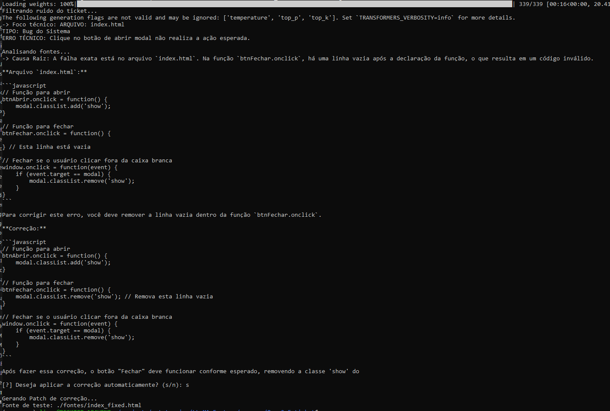

# Sistema de Diagnóstico e Recuperação Autônoma de Código (SDRA)

Este repositório contém uma implementação de agentes de inteligência artificial projetados para automatizar a triagem e a correção de falhas em ambientes de desenvolvimento de software.

## Objetivos do Sistema

O SDRA visa eliminar o gargalo humano entre o recebimento de um ticket de suporte e a aplicação de um patch técnico. O sistema processa descrições em linguagem natural, identifica a causa raiz em arquivos fonte e propõe correções de código puro, reduzindo o Tempo Médio de Reparo (MTTR) de horas para segundos.

## Implementação de Autotunning e Eficiência

O motor principal utiliza o modelo **Qwen2.5-Coder-7B-Instruct** com configuração **4-bit (NF4)**. 
- **Otimização de Contexto**: O uso de `BitsAndBytesConfig` com `double_quant` permite que o modelo opere com alta precisão lógica ocupando apenas ~5.5GB de VRAM.
- **Injeção de Fontes**: O sistema mapeia diretórios locais, oque permite que o agente "enxergue" o código atual antes de propor alterações, garantindo que a correção respeite a sintaxe original.

## Impacto na Operação Empresarial

A automação do ciclo de vida do bug gera ganhos em três frentes:
1. **Triagem Técnica**: Conversão imediata de reclamações informais em dados estruturados (Arquivo, Tipo de Bug, Erro Técnico).
2. **Escalabilidade**: Capacidade de processar centenas de relatos simultaneamente sem sobrecarregar a equipe de engenharia.
3. **Redução de Custo Cognitivo**: Desenvolvedores podem focar em arquitetura enquanto o agente resolve falhas triviais de sintaxe ou lógica em arquivos front-end e back-end.

## Projeção de Viabilidade Financeira (Cloud GPU)

A operação deste sistema é otimizada para provedores de GPU por demanda, permitindo uma execução de baixo custo.

| Provedor | Hardware Recomendado | Custo Estimado (Hora) | Throughput Esperado |
| :--- | :--- | :--- | :--- |
| **Vast.ai** | NVIDIA RTX 3060 / 4060 Ti | $0.06 - $0.15 | 80 - 110 tokens/s |
| **RunPod** | NVIDIA RTX 4090 | $0.34 - $0.45 | 180 - 240 tokens/s |

**Custo por ciclo**: Uma análise completa, ou seja Triagem + Diagnóstico + Patch. Consome aproximadamente 3.000 tokens. Em uma RTX 4090, isso representa um custo computacional **APROXIMADO** de **$0.002 USD** por correção.

## Referências Técnicas

Os dados apresentados são estimativas referenciais e não garantem resultados fixos. A performance real e os custos operacionais podem variar (para mais ou para menos). A metodologia utilizada para estas projeções fundamenta-se nos estudos e ferramentas:

* [Análise de Hardware para Deep Learning](https://timdettmers.com/2018/12/16/deep-learning-hardware-guide/)
* [Aritmética de Inferência em Transformers](https://kipp.ly/transformer-inference-arithmetic/)

## Demonstração de Execução

Abaixo, um registro do fluxo de processamento do `index.py`, demonstrando a triagem, o diagnóstico e a geração do patch:

